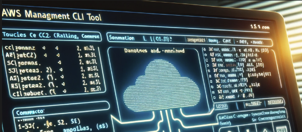

# AWS Management CLI Tool



**AWS Management CLI Tool** is a powerful, user-friendly command-line utility designed to streamline your AWS resource management tasks. Instead of navigating through the AWS Console or writing custom scripts, use this tool to quickly view, manage, and monitor your cloud resources.

## 🚀 Features

- **Interactive Navigation**: Traverse seamlessly through multiple AWS service categories using a clear, structured menu.

- **Unified Management**: Why juggle between different AWS tools when you can have one? From EC2 to Lambda to S3, manage them all from one place.

- **Detailed Listings**: Get comprehensive views of your AWS resources. Whether it's spotting a rogue EC2 instance or checking the permissions on an S3 bucket, this tool has you covered.

- **Error Handling**: No more cryptic AWS errors. Our tool provides clear error messages to help diagnose issues quickly.

- **Extensibility**: Built with modularity in mind, it's easy to extend the tool to incorporate more AWS services or additional functionalities.

## 🛠️ Getting Started

### Requirements

- **Python 3.x**
- **Boto3**: The AWS SDK for Python. Install it with pip:

  ```bash
  pip install boto3
  ```

- Properly configured AWS Credentials, either using environment variables or the `~/.aws/credentials` file.

## Usage

1. Ensure you are in the directory containing the script.
2. Run the script:

   ```bash
   python AWS_Recon.py
   ```

3. Navigate through the interactive menu to manage or list AWS resources.

### Available Options

1. **Compute**:
    - List EC2 Instances
    - List Lambda Functions
    - List Elastic Beanstalk Apps Environments

2. **Storage**:
    - List Public S3 Buckets
    - List S3 Bucket Permissions
    - List Dynamodb Tables
    - List EBS Volumes

3. **Database**:
    - List RDS Instances

4. **Network**:
    - List VPCs & Subnets
    - List Security Groups & Rules
    - List Elastic Load Balancers
    - List Cloudfront Distributions
    - List Route53 Zones Records
    - List VPC Peering Connections
    - List Direct Connect Connections

5. **Containers**:
    - List ECS Clusters & Services

6. **Security**:
    - List IAM Users
    - List IAM Roles Policies

7. **Monitor**:
    - List Cloudwatch Alarms

8. **Development**:
    - List API Gateway APIs

### Error Handling

The tool provides basic error handling, ensuring that any AWS-related errors are displayed in a user-friendly manner. If you encounter issues not covered by the error handling, please check your AWS setup and credentials.

## 📝 Feedback & Contributions

We're always looking to improve and expand this tool. If you encounter issues, have feature requests, or want to contribute, please:

1. Fork the repository.
2. Create a new branch (`git checkout -b new-feature-branch`).
3. Make your changes.
4. Commit your changes (`git commit -am 'Add a new feature'`).
5. Push to the branch (`git push origin new-feature-branch`).
6. Create a new Pull Request.

## License

This project is licensed under the MIT License. See the [LICENSE](LICENSE) file for details.
